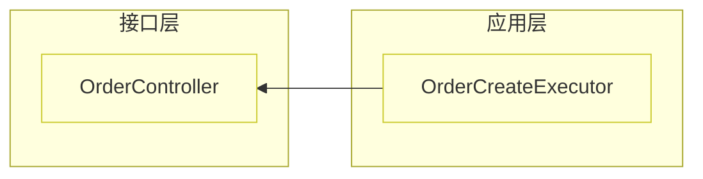

# impact-guard 技术设计文档（评审稿）

> **状态**：可行性已验证 ✅ · 经 grill 压力测试修订 · 待评审通过后落地为 `skills/impact-guard/`
> **范围**：v1 完整版（json/text + mermaid 影响图 + 直接/间接分级 + 5 通道边界）
> **作者**：— · **日期**：2026-08-13

---

## 1. 背景与动机

### 1.1 起源：CodeSee 的 XY 问题

初始诉求是"把 CodeSee 接入项目"。经第一性原理拆解，判定为 **XY 问题**：

- **CodeSee 真实价值**：大型陌生代码库的依赖地图 + 变更影响分析（blast radius）+ 时间维度演进。
- **awesome-rules 仓库性质**：规范 + AI Agent 技能仓库，自身无可视化的复杂依赖；其服务的对象是 **GTSP / fss 微服务代码库**。
- **结论**：CodeSee 的依赖地图对 awesome-rules 本身无用武之地；它真正要解决的 X 是 **"让 GTSP 微服务代码库更易被理解和导航"**，且应通过**增强现有技能**而非引入外部 UI 工具实现。

### 1.2 现状缺口

| 能力维度 | doc-gen | arch-guard | codebase-memory-mcp | 缺口 |
|---|---|---|---|---|
| 依赖地图（可浏览） | Mermaid 快照，粒度到层/聚合 | 图谱存在，仅查违规 | 有能力，是 API 非地图 | 缺"定向影响浏览"出口 |
| **变更影响分析** | ✗ | ✗（是违规检测） | `query_graph` 能做 | **完全缺失，日常价值最高** |
| 时间维度演进 | ✗ | ✗ | ✗ | 缺失（v1 不做） |
| 实时/开发态 | ✗（构建发布） | CI 门禁 | 会话内实时 | 缺"改码前自动 impact" |

**核心洞察**：底层引擎（依赖图谱、调用链）已存在于 `codebase-memory-mcp`，缺的是两个出口——**给人看的出口**（可嵌入站点的 mermaid 影响图）与**给 Agent 用的出口**（变更前可程序化调用的 CLI）。impact-guard 即为这两个出口的载体。

### 1.3 为什么不直接用 CodeSee

1. CodeSee 据公开信息已于 2023 年前后停止运营，接入前提存疑。
2. CodeSee 是"给人看的 UI"，而 awesome-rules 定位是"给 Agent + 人审查"，需要可程序化调用。
3. CodeSee 是通用工具，不懂 GTSP 的业务关键路径（对外契约、跨域 Feign、DB 写入）。

### 1.4 可行性验证与 grill 修订（已完成 ✅）

设计前实测验证 Tier 2 可行性，并对草案做了 7 轮 grill 压力测试，挖出 3 个设计 bug 并修订：

- **项目已 index**：`codebase-memory-mcp` 已索引 11 个 GTSP 项目（节点 207~34291），Tier 2 前提满足。
- **影响链可达**：实测 `AppMsgInfoAssembler.build`（fan-in=14）经 3 跳反查抵达 `MsgTaskSendStatsController` 对外接口——🔴 判定链路成立。
- **3 个设计 bug 已修**：① Tier 1 盲区描述错（@Autowired/Feign 有 import，能覆盖）；② Feign 动态代理调用边图谱建不出（8 个 `@FeignClient` 全 `in_degree=0`）；③ arch-guard 式 baseline 在 impact-guard 语义不通，已放弃。
- **工具选型**：`trace_path` 对完整 `qualified_name` 匹配不稳定，Tier 2 以 `query_graph` 动态 Cypher 为主。

---

## 2. 目标与非目标

### 2.1 目标（v1）

1. **G1 变更点识别**：从 git diff 或显式指定提取变更起点（类/文件级）。
2. **G2 影响传播**：沿图谱计算受影响节点（inbound），支持深度控制。
3. **G3 关键路径分级**：按「**直接 vs 间接**」+ GTSP 业务语义（5 类基础设施边界）分级，门禁只拦直接高风险。
4. **G4 三态输出**：`text`（人读）、`json`（机读）、`mermaid`（可嵌入 doc-gen 站点 / PR 描述）。
5. **G5 图谱主路径**：v1 以 Tier 2（`query_graph`）为主，Tier 1（import 索引）降为图谱未 index 时的文件级 fallback。
6. **G6 不沉默原则**：跨服务边界 / 过期图谱 / 入口组件无法分析——一律显式告警，绝不假装权威。

### 2.2 非目标（v1 明确排除）

- ❌ 时间维度演进（架构随 commit 退化的多快照 diff）——成本高，YAGNI。
- ❌ 方法级 git diff 解析——v1 只到文件/类级，方法级列为 📋。
- ❌ IDE 实时插件——通过 Agent 会话内调用 + CI 实现"准实时"，不做 IDE 集成。
- ❌ **baseline 噪声冻结**——arch-guard 的"存量违规基线"针对代码状态，impact-guard 针对变更事件，**无存量可冻结，语义不通，放弃**。噪声靠「直接/间接分级」抑制（见 §6）。
- ❌ **跨服务影响传播**——v1 限定单服务内；跨服务契约（`@FeignClient`/`-client`）仅识别为 🔴 直接 + 强制告警，真正跨服务传播列 v2。

---

## 3. 职责边界

impact-guard 与现有技能**底层共享、提问不同**，严格遵循单一职责：

| 技能 | 回答的问题 | 形态 | 时态 | 触发 |
|---|---|---|---|---|
| arch-guard | "这代码违规了吗？" | 全量规则检查（二元对错） | 静态现状 | CI 门禁 / 审查 |
| doc-gen | "这项目的架构长什么样？" | 静态文档站点 | 项目快照 | 文档发布 |
| **impact-guard** | **"改这个，会波及谁？"** | **定向影响传播** | **变更增量** | **提交前 / Agent 改码前 / PR** |

**边界规则**：
- impact-guard **复用** arch-guard 的 `JavaScanner` / `LayerIdentifier` / `SUFFIX_TYPE_MAP`，不重写（DRY）。
- impact-guard **不重复** arch-guard 的违规检测逻辑，不做"对/错"判定。
- impact-guard **不生成** doc-gen 的全景文档，只产出"某次变更的影响切片"。

---

## 4. 架构（Tier 2 主路径 + Tier 1 fallback）

> Grill 修订：原设计两层并重。实测发现 GTSP 主流调用（@Autowired/Feign）Tier 1 import 索引本就能覆盖（因有 import 语句），Tier 1 与 Tier 2 差异是**粒度**而非盲区；且 11 个项目都已 index。故 v1 **只实现 Tier 2**，Tier 1 降为未 index 时的文件级 fallback。

| 层级 | 实现 | 精度 | 定位 |
|---|---|---|---|
| **Tier 2（主）** | `codebase-memory-mcp` `query_graph` 动态 Cypher | 方法级 `qualified_name` | v1 核心路径，所有影响传播/分级基于此 |
| **Tier 1（fallback）** | `impact_check.py`（import 反向索引，复用 JavaScanner） | 文件/类级 | 仅当项目未 index 时降级，头部告警 `[Tier 1 only]` |

```
git diff / --changed
        │
        ▼
  变更点提取 (ChangeExtractor)
        │
        ▼
  ┌── Tier 2（主）: GraphTracer ───────────────┐
  │  head_sha 新鲜度检测：过期则自动 reindex     │
  │  （--skip-reindex 可跳过）                    │
  │  query_graph 动态 Cypher（--mode graph 生成） │
  │  精确 caller → callee 证据链                  │
  │  不可用（未 index）→ 降级 Tier 1              │
  └──────────────────────────────────────────────┘
        │
        ▼
  ImpactReport → CriticalRanker（直接/间接分级） → Renderer (text/json/mermaid)
```

**Tier 1 fallback 触发条件**：项目未 index 且用户未触发 reindex。此时输出头部强制标注 `[Tier 1 only — 图谱未索引，方法级影响不可见]`，且不产生 🔴 直接判定（直接判定依赖方法级图谱）。

---

## 5. 影响传播算法

### 5.1 变更点提取（ChangeExtractor）

两种输入，归一为 `List[ChangePoint]`：

- **`--diff <ref>`**（默认 `origin/master...HEAD`）：解析 `git diff --name-only` + hunks，映射到类。
  - 文件 → 类：复用 `JavaScanner` 的文件/包推断（一个 `.java` ↔ 一个主类）。
  - v1 粒度：**类级**（不解析方法级 hunks）。
- **`--changed <qn|file>`**（可多次）：显式指定，直接作为起点。

`ChangePoint` 数据结构：

```python
@dataclass
class ChangePoint:
    qualified_name: str      # com.example.order.app.OrderCreateExecutor
    file_path: str
    layer: str               # adapter / app / domain / infra（复用 LayerIdentifier）
    change_type: str         # modified / added / deleted（来自 diff）
```

### 5.2 Tier 1 fallback：import 反向索引

**索引构建**（一次性，复用 arch-guard 扫描器）：

```
扫描所有 .java 的 import 语句
  → reverse_index[被import的类] = {依赖它的文件/类集合}
```

> 复用 arch-guard `JavaScanner`：它已具备 import 提取与包前缀过滤（`project_package_prefix`），无需重写。

**传播**：以每个 `ChangePoint` 为根，沿 `reverse_index` 做 BFS 至 `--depth`（默认 3），收集受影响方（inbound 方向）。

**精度盲区**（grill 实测修正，须在输出显式标注）：

> ⚠️ **修正**：原设计误将 @Autowired/Feign 列为盲区——这二者调用方代码必然 import 目标类，Tier 1 **能覆盖**。真盲区如下。

- `import xxx.*` 通配 → 按包前缀保守匹配（可能多报）。
- **反射**（`Class.forName`/字符串类名）/ **动态代理** / **多态集合分发的具体实现**（`List<Interface>` 注入，实现类未被 import）→ import 索引识别不到；**Tier 2 图谱同样盲**。
- 结论：Tier 1 与 Tier 2 的真实差异是**粒度（类 vs 方法）**，而非盲区大小。

### 5.3 Tier 2（主）：图谱 query_graph + 影响方向

**前置**：项目已 `index_repository`。不可用时降级 Tier 1，输出头部标注 `[Tier 1 only]`。

**主路径**：`--mode graph` 生成动态 Cypher，经 `query_graph` 反查多跳 caller 链。实测 `trace_path` 对完整 `qualified_name` 匹配不稳定（"function not found"），故以 `query_graph` Cypher 为主（与 arch-guard Tier 2 完全统一），`trace_path` 仅作交互态备选。

**影响方向**（grill 修订：诚实区分两种产物，不伪装）：

| 变更点类型 | 产出 | 说明 |
|---|---|---|
| 普通类（Service/Assembler/Executor） | `impact`（inbound 证据链） | 追溯"谁调用了我"——**真正的影响传播** |
| 框架入口（Controller/MQ Listener/JobHandler/Callback 接口实现） | `无法分析影响` + `regression_scope`（outbound 下游树） | 被 Spring 反射/MQ 驱动，图内**无入边**，inbound 不可见**符合预期**。**不伪装成影响分析**——明确标注"入口组件，影响无法静态分析"，另起一节给下游依赖树作为**回归建议** |

> 实测证据：`DongxinSmsCallbackHandler.handle`（接口实现，`List` 注入分发）图内 0 入边；`crm-gtsp-crm-task` 的 8 个 `@FeignClient` 接口亦全 `in_degree=0`——Feign 动态代理调用边图谱建不出。故 🔴 间接"抵达 Feign 出站"会漏，仅"变更点本身是 Feign 接口"的 🔴 直接可判（靠 `--init` 注解扫描，见 §6）。

**Cypher 动态生成**（对齐 arch-guard `--mode graph` 惯例，不手抄）：

```bash
python3 scripts/impact_check.py --mode graph --config .impact-guard.json
```

输出适配本项目配置的 Cypher 模板清单，供人工粘贴 `query_graph` 执行。**不在文档手抄副本**——脚本是 single source of truth。

### 5.4 图谱新鲜度（grill 新增）

`index` 是某 commit 的快照。运行时对比 `index head_sha` 与当前 `git HEAD`：

- **一致** → 图谱新鲜，直接跑。
- **不一致（过期）** → 自动触发 `index_repository` reindex；`--skip-reindex` 可跳过（接受过期风险）。
- 输出始终标注图谱基于的 `head_sha`。

impact-guard **不实现索引逻辑**（那是 codebase-memory 职责），只编排"检测过期 → 触发 reindex"。

---

## 6. 关键路径分级模型

impact-guard **相对通用工具（CodeSee）的差异化价值**——懂 GTSP 业务语义。grill 修订：分级改为「**直接/间接**」+ **5 类基础设施边界**。

### 6.1 5 通道 × 2 方向边界矩阵

关键路径 = 跨进程 / 状态变更的边界。原"entrypoints/sinks 两分法"过粗，扩为 5 通道：

| 通道 | 入站入口（框架驱动，inbound 盲→走回归范围） | 出站/落点（变更点=此→🔴 直接） |
|---|---|---|
| HTTP | `@RestController`/`@Controller` | Feign 客户端调用 |
| MQ | `@RocketMQMessageListener`/`@KafkaListener` | 消息发送调用（Producer） |
| DB | — | MyBatis `@Mapper` |
| 缓存 | — | `RedisUtil`/`@CachePut`/`@CacheEvict` |
| 定时任务 | `@XxlJob`/JobHandler | — |

**识别方式统一**：全部由 `--init` 扫描注解 + 第三方 SDK 调用模式动态生成（第三方不在图谱，必须源码扫描）。glob 仅作手动覆盖。

### 6.2 直接/间接分级（替代原单一 🔴）

| 级别 | 触发 | 门禁 |
|---|---|---|
| 🔴 **直接** | 变更点**本身就是**出站/落点列（Producer/Mapper/Redis 写/Feign 出站/`-client` 对外 API） | `--strict` exit 1 阻断 |
| 🟠 **间接抵达** | 普通类变更，影响链经 ≥1 跳抵达边界（潜在波及） | 不阻断，告警 + 附回归范围 |
| 🟡 Warning | 影响穿越跨服务边界（但未跨出本服务）；或触及聚合根 | 不阻断 |
| 🟢 Info | 仅同层/内部实现 | — |

> **为什么拆直接/间接**：实测连底层 `AppMsgInfoAssembler.build` 都 3 跳抵达 Controller——大型 GTSP 项目里几乎所有业务改动都会"间接抵达"某边界。若 🔴 二元，门禁会通胀失效。门禁只拦"直接动了对外契约/DB 落点"这种确定高风险。

### 6.3 匹配规则

- **主**：注解匹配（`@RestController`/`@Mapper`/`@FeignClient` 等，复用 `JavaScanner` 注解提取），`--init` 扫描生成精确清单。
- **辅**：Ant-style glob（用户手动覆盖，如 `**.interfaces.facade.**`）。
- 匹配目标：`qualified_name` + 注解集合。

---

## 7. CLI 接口规范

```bash
python3 scripts/impact_check.py <project_root> [选项]
```

| 参数 | 类型 | 默认 | 作用 |
|---|---|---|---|
| `project_root`（位置） | str | `.` | 目标项目根 |
| `--diff <ref>` | str | `origin/master...HEAD` | 从 git diff 提取变更点 |
| `--changed <qn\|file>` | list | — | 显式变更起点（可多次） |
| `--depth <n>` | int | `3` | 影响传播深度 |
| `--mode {quick,graph}` | choice | `quick` | quick=Tier1 fallback / graph=输出 Tier2 Cypher 清单 |
| `--format {text,json,mermaid}` | choice | `text` | 输出格式 |
| `--strict` | flag | off | 触及 🔴 **直接**则 exit 1 |
| `--config` | path | 自动查 `.impact-guard.json` | 配置文件 |
| `--init` | flag | — | 扫描注解动态生成配置（含边界清单） |
| `--skip-reindex` | flag | off | 跳过过期自动 reindex（接受过期风险） |
| `--verbose` / `-v` | flag | off | 详细输出 |

> 完整参数由脚本 `--help` 输出，不在此静态复制。

**退出码**（对齐 arch-guard）：
- `0` = 无 🔴 直接影响
- `1` = 触及 🔴 直接关键路径（`--strict`）
- `2` = 运行错误（git 失败、扫描异常等）

---

## 8. 配置规范（grill 修订：动态生成）

> ⚠️ **修正**：原设计写死 glob 默认值（`**.adapter.**` 等）。实测 GTSP Controller 全在 `interfaces.facade.*`（0 个在 adapter），glob 默认值**命中 0**，分级失效。改为 `--init` 扫描注解动态生成。

`--init` 扫描项目注解 + SDK 调用，生成 `.impact-guard.json`：

```json
{
  "project_package_prefix": "com.acme",
  "boundaries": {
    "http_entry":   ["@RestController", "@Controller"],
    "http_exit":    ["@FeignClient"],
    "mq_entry":     ["@RocketMQMessageListener", "@KafkaListener"],
    "mq_exit":      ["rocketMQTemplate.*", "kafkaTemplate.*"],
    "db_sink":      ["@Mapper"],
    "cache_sink":   ["RedisUtil", "@CachePut", "@CacheEvict"],
    "job_entry":    ["@XxlJob"]
  },
  "highways": ["**Util", "**Assembler"],
  "ignore": ["**/test/**", "**/dto/**", "**/query/**"]
}
```

| 配置项 | 作用 | 来源 |
|---|---|---|
| `project_package_prefix` | 包前缀过滤 | `--init` 从 pom.xml 推断 |
| `boundaries` | 5 通道边界清单（驱动 🔴 直接/间接判定） | `--init` 扫描注解/SDK 调用 |
| `highways` | 高速通路白名单（公共工具/Assembler，影响面大但可控，降级） | `--init` 启发式 + 人工调整 |
| `ignore` | 不计入传播的路径 | 手动 |

glob 仅作 `boundaries`/`highways` 的手动覆盖项，不作为默认。

---

## 9. mermaid 影响图规范

### 9.1 布局

- `graph RL`：变更点居左，受影响方向右扩散。
- **泳道**：按 DDD 分层 `subgraph`，节点归位所属层。
- **节点边框分级**：`classDef` 定义四色（🔴直接 / 🟠间接 / 🟡 / 🟢）。



### 9.2 折叠策略

- 节点数 ≤ 20：全量展开。
- 节点数 > 20：折叠到**聚合根级别**，标注受影响方法数。

### 9.3 变更点视觉标记

变更起点用双线边框 + `[CHANGED]` 标签。

---

## 10. 与 doc-gen 的集成

### 10.1 时态冲突的处理

doc-gen = **项目静态快照**，impact-guard = **变更增量**。集成方式是**"在快照站点上叠加增量影响视图"**，不混淆。

### 10.2 集成形态

| 场景 | 形态 |
|---|---|
| doc-gen 站点 | 新增 `/impact/` 交互页：输入变更点 → 调 `impact_check.py --format mermaid` 实时渲染。复用站点已有 RAG/manifest 能力定位节点。 |
| PR 描述 | `--format mermaid` 直接输出，贴入 PR；`--format json` 供 CI 注释。 |
| CI 门禁 | `--strict` 模式，触及 🔴 直接则 fail，附 text 证据链。 |

### 10.3 doc-gen 侧改动

- `template/` 新增 `/impact/` 路由页面（Astro 组件）。
- v1 先做"CLI 输出 mermaid 贴入"，站点内嵌列为 📋 v1.1。

---

## 11. 目录结构与模块划分

```
skills/impact-guard/
├── SKILL.md                 # 技能定义（触发词 + 使用说明）
├── README.md                # 快速使用（对齐 arch-guard README 风格）
├── DESIGN.md                # 实现设计（落地副本）
├── scripts/
│   ├── impact_check.py      # CLI 主入口
│   ├── change_extractor.py  # git diff / --changed → ChangePoint
│   ├── impact_scanner.py    # Tier 1 fallback: import 反向索引（复用 arch-guard JavaScanner）
│   ├── graph_tracer.py      # Tier 2: query_graph Cypher + 影响方向 + 新鲜度检测/reindex
│   ├── boundary_scanner.py  # --init: 扫描注解/SDK 调用生成 boundaries 清单
│   ├── critical_ranker.py   # 直接/间接分级
│   ├── renderer.py          # text / json / mermaid 三态渲染
│   ├── pytest.ini
│   └── tests/
│       └── test_impact_check.py
├── fixtures/
│   └── ddd-sample/          # mini DDD 样本项目（参考 doc-gen cola-sample）
└── badcase/                 # 影响分级样例场景
```

**模块职责单一（SRP）**：提取 / 扫描 / 图谱 / 边界 / 分级 / 渲染各自独立，CLI 仅做编排。

---

## 12. 测试策略

对齐 arch-guard（53 条）与 doc-gen 惯例，覆盖率目标 >90%。

| 测试类 | fixtures 构造 | 覆盖点 |
|---|---|---|
| 变更点识别 | git diff 样本 | `--diff` / `--changed` 解析、文件→类映射 |
| 影响传播 | 多层依赖样例 | BFS 深度、inbound 正确性、`ignore` 过滤 |
| 影响方向 | 普通类 + 框架入口 | 普通类→impact；入口→无法分析+回归范围 |
| 关键路径分级 | 直接/间接/跨服务各一 | 🔴直接/🟠间接/🟡/🟢 判定、`--strict` 退出码 |
| 边界扫描 | 含注解样例 | `--init` boundaries 生成（5 通道） |
| mermaid 生成 | 分级样例 | 布局、泳道、折叠阈值、四态 classDef |
| 新鲜度 | head_sha 一致/过期 | reindex 触发、`--skip-reindex`、降级 |

`fixtures/ddd-sample/` 复刻最小可运行 DDD 项目（含 Controller/Mapper/Listener/Feign/RedisUtil 各类边界）。

---

## 13. v1 实施范围与状态

> 状态语义：📋 = v1 待实现（脚本尚未开发）；✅ = 已实现。

| 功能 | 状态 |
|---|---|
| git diff → 变更点（类级） | 📋 v1 |
| `--changed` 显式起点 | 📋 v1 |
| Tier 2 query_graph Cypher + 影响方向 | 📋 v1 |
| Tier 1 fallback（import 索引，未 index 时降级） | 📋 v1 |
| 图谱新鲜度检测 + 增量 reindex + `--skip-reindex` | 📋 v1 |
| `--init` 扫描注解动态生成 boundaries（5 通道） | 📋 v1 |
| 直接/间接分级（🔴直接/🟠间接/🟡/🟢） | 📋 v1 |
| 跨服务契约识别为 🔴 直接 + 强制告警 | 📋 v1 |
| text / json / mermaid 输出 | 📋 v1 |
| PR 场景 + CI `--strict` 门禁（只拦直接） | 📋 v1 |
| doc-gen `/impact/` 站点内嵌 | 📋 v1.1 |
| 方法级 git diff 解析 | 📋 v2 |
| 跨服务影响传播（cross-repo-intelligence） | 📋 v2 |
| ~~baseline 噪声冻结~~ | ❌ 放弃（语义不通） |
| 时间维度演进 | ❌ 不在路线 |

---

## 14. 风险与开放问题

### 14.1 风险

| 风险 | 影响 | 缓解 |
|---|---|---|
| 多态集合分发 / Feign 动态代理调用边缺失 | 🔴 间接"抵达边界"漏报 | 边界靠 `--init` 注解扫描；间接降为告警不阻断；输出标注盲区 |
| 框架入口组件图内无入边 | inbound 漏报入口 | 拆「无法分析」+「回归范围」，不伪装（§5.3） |
| 图谱过期 | 影响集基于旧代码 | head_sha 检测 + 自动 reindex + `--skip-reindex`（§5.4） |
| 跨服务影响不可见 | 改 Feign/-client 的下游服务漏报 | 识别为 🔴 直接 + 强制告警"跨服务未分析" |
| mermaid 大图性能 | 渲染卡顿 | >20 节点折叠到聚合根 |
| 边界扫描漏识别新型中间件 | 🔴 判定不全 | `--init` 启发式 + glob 手动覆盖； highways/ignore 逃生阀 |

### 14.2 开放问题（评审时讨论）

1. **`highways` 默认启发式**：哪些类算"高速通路"（`**Util`/`**Assembler`/`*Config`）？降级到 🟡 还是忽略？
2. **缓存 sink 粒度**：`RedisUtil` 整个类算 sink，还是只写方法（`set`/`put`/`delete`）？
3. **doc-gen `/impact/` 内嵌**：是否纳入 v1（当前 📋 v1.1）。
4. **与 arch-guard 输出统一**：是否共享 reporter 模块。
5. **reindex 成本**：CI 每次 PR 自动 reindex 的耗时是否可接受，需否缓存。

---

## 15. 评审检查清单

- [ ] **动机**：XY 问题论证充分，增强现有技能优于引入 CodeSee？
- [ ] **职责边界**：与 arch-guard / doc-gen 无功能重叠，SRP 清晰？
- [ ] **接口惯例**：CLI / 退出码 / 配置 / 目录结构对齐现有技能？
- [ ] **分级模型**：直接/间接拆分合理？5 通道边界覆盖 GTSP 实际？
- [ ] **不沉默原则**：跨服务 / 过期图 / 入口无法分析——是否都显式告警？
- [ ] **复用**：复用 arch-guard 扫描器，未重写？
- [ ] **精度降级**：Tier 2 不可用时行为明确、不静默？
- [ ] **YAGNI**：非目标项（演进/方法级 diff/baseline/跨服务传播）排除合理？
- [ ] **测试**：核心逻辑有 fixtures 覆盖，>90%？
- [ ] **盲区**：3 个已修 bug 是否都已反映到文档？

---

## 附录 A：典型使用场景

**场景 1 — Agent 改码前自检**
```
用户："帮我重构 OrderCreateExecutor 的 calc 方法"
Agent：先调 impact_check.py --changed OrderCreateExecutor --strict
     → 判定为 🟠 间接抵达 OrderController（不阻断）
     → 提示"潜在波及对外接口，建议回归；非直接契约变更，不阻断"
```

**场景 2 — PR 影响说明**
```bash
python3 scripts/impact_check.py . --diff origin/master...HEAD --format mermaid > impact.mmd
# impact.mmd 贴入 PR 描述，reviewer 一眼看到波及范围与分级
```

**场景 3 — CI 门禁（只拦直接）**
```yaml
- name: 变更影响门禁
  run: |
    python3 skills/impact-guard/scripts/impact_check.py src/ \
      --diff origin/master...HEAD --strict --format json
  # 仅触及 🔴 直接（直接改了 Feign/Mapper/对外 API）才 exit 1 阻断
```

**场景 4 — 跨服务契约告警**
```
变更点 = @FeignClient 接口（出站契约）
→ 🔴 直接 + 输出 "⚠️ 跨服务影响未分析——需人工评估下游服务"
```
