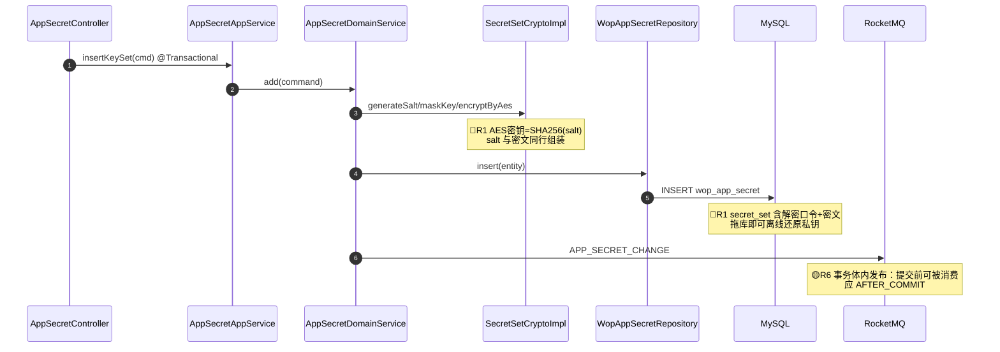

# 可视化审查输出（visual-output）

> 适用场景：审查结论需要跨层调用链或业务流程承载时（用户说「画流程图」「时序图」
> 「标注风险点的图」，或审查对象是 Controller→DAO 链路 / 网关数据面这类多参与者
> 业务流），把发现落到 mermaid 图上。是 SKILL.md 两轴流程的**输出增强**，
> 不是替代——图上的每条风险标注仍须来自两轴发现或证据链核查。

## 为什么时序图优于流程图（标注风险时）

流程图节点是「模块」，风险只能涂色；时序图的消息是「调用」，风险可以
`Note over` 钉在**确切触发点**（哪一次调用、哪个参与者、事务内还是事务外）。
实测对照（gtsp-wop-service 审查，2026-08-24）：

| 表达 | 流程图 | 时序图 |
|---|---|---|
| 「MQ 事件在事务提交前发布」 | 只能节点涂橙 | Note 钉在 `DS->>MQ: 事件` 消息与 `@Transactional` 边界之间 |
| 「解密口令与密文同列」 | 节点涂红 | Note 钉在 `INSERT wop_app_secret` 消息上 |
| 「先查后插竞态」 | 节点涂黄 | Note 钉在 `checkUnique` 消息后、`insert` 消息前 |

分工：**flowchart 画静态域关系**（谁依赖谁），**sequenceDiagram 画调用时序**
（谁何时调谁）。一份报告两种图各取所长，不要用时序图画静态结构。

## 画法约定

### 参与者 = 架构分层

```
participant C as XxxController
participant AS as XxxAppService        ← @Transactional 边界画在这层
participant DS as XxxDomainService
participant R as XxxRepository
participant DB as MySQL                ← 外部系统（DB/MQ/缓存）单独列出
participant MQ as RocketMQ
```

- 一个业务场景一张图（一个用例/一个端点族），不合并多场景
- `autonumber` 必开——评审讨论时用「第 7 步」指代
- 事务边界用 `Note over AS,DB: ✅ 跨表写同事务覆盖` 显式标出

### 风险标注 = Note over + 统一编号

- `🔴 R1` / `🟠 R2` / `🟡 R3` 全局递增编号，图与正文清单共用同一编号空间
- **✅ 也标**：行锁、CAS、事务覆盖等已验证的防线。只标风险的图会让读者
  以为全链路裸奔；防线位置同样是审查结论
- Note 文本挂「触发的确切消息」，不挂在空白处

### 示例（节选自真实审查）



## 证据链核查环（防图上误报）

图比文字更容易被当成事实——一条错误的风险标注会随图扩散。落图前对每条
标注执行（与两轴的可证伪性条款同源，这里是聚合方的自检）：

1. **正向证据**：风险标注旁必须可附 `file:line`（图注或正文清单）
2. **反证搜索**：存在性/否定性断言（「无鉴权」「未发事件」「无兜底」）全仓
   grep 反向验证。实测两类高频误报：
   - 「X 域未发事件」→ 注解扫描推翻：publisher 注入了 6 个域服务，
     初判「8 域静默」实为 4 域有事件（误报收敛）
   - 「两步写无原子性」→ 外层确有 `@Transactional`，真实缺陷是
     事务内发事件的时序（定性修正，不是无事务）
3. **边界声明**：代码层无法证伪的（部署层网络策略、消费方轮询）在图外
   单列「遗留验证边界」，不画进图里假装确定

修正不删痕：正文清单保留「初判→核查后」的差异记录，防止后人复查再犯。

## Mermaid 语法坑（实测）

- **`Note` 文本禁用半角分号 `;`**——sequenceDiagram 解析器把 `;` 当语句
  终止符，即使出现在 Note 文本中间，Note 从分号处截断、残句按消息解析，
  报 `Expecting ARROW, got NEWLINE`。一律用全角 `；`
- Note 内换行用 `<br/>`；参与者别名 `as` 后的文本避免 `[` `]` `{}`
- 交付前逐块渲染验证（半分钟拦住全部语法错）：

  ```bash
  awk '/^```mermaid/{n++; f="M"n".mmd"; b=1; next} b && /^```$/{b=0; next} b{print > f}' REPORT.md
  mmdc -p puppeteer.json -i M1.mmd -o /tmp/M1.svg   # 16 块 ~6s
  ```

- 渲染环境：`npm i -g @mermaid-js/mermaid-cli` + `puppeteerConfig`
  指向本机 Chrome（puppeteer 自带 Chromium 可能未随装）

## 代码更新后的图维护

审查对象拉取新代码后，图不重画，走增量：

1. `git diff <上次审查HEAD>..HEAD --stat` 圈定变更域
2. 只重核受影响的图与风险条目；未触及的标注「维持」
3. 新增风险接续编号（R12、R13…），修正的条目保留初判记录
