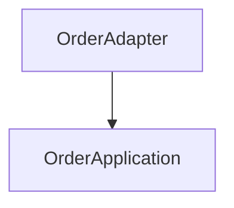

# doc-gen 技术设计文档

## 1. 总览

`doc-gen` 是一个 CLI 工具，将 Java DDD 项目的架构信息自动转换为交互式静态文档站点。

```
源代码仓库 → CLI 扫描 → DocManifest JSON → Astro 构建 → 静态站点
```

## 2. 数据管道

### 2.1 扫描阶段（Python CLI）

```
项目根目录
  ├──[pom.xml 解析]────────→ Maven 模块结构、依赖关系
  ├──[包路径扫描]──────────→ DDD 分层识别（adapter/app/domain/infra）
  ├──[Java 文件解析]───────→ Controller/Service/Entity/Repository 提取
  ├──[OpenAPI 提取]────────→ REST API 定义（注解解析）
  ├──[DDL 文件扫描]────────→ 数据库表结构
  └──[Git 元数据]──────────→ 最后修改人、变更频率
            │
            ▼
      doc-manifest.json
```

### 2.2 DocManifest JSON Schema

```json
{
  "$schema": "https://awesome-rules.dev/doc-gen/schema/v1.json",
  "meta": {
    "schemaVersion": "1.0",
    "generatedAt": "2026-07-31T22:00:00+08:00",
    "generator": "doc-gen v1.0.0",
    "project": {
      "name": "order-system",
      "groupId": "com.example",
      "description": "订单管理系统",
      "repo": "https://github.com/example/order-system"
    }
  },
  "domains": [
    {
      "name": "order",
      "displayName": "订单域",
      "description": "订单的创建、支付、取消、查询",
      "modulePrefix": "order",
      "layers": {
        "adapter": {
          "javaPackage": "com.example.order.adapter",
          "mavenModule": "order-adapter",
          "components": [
            {
              "type": "controller",
              "className": "OrderController",
              "qualifiedName": "com.example.order.adapter.controller.OrderController",
              "sourcePath": "order-adapter/src/main/java/com/example/order/adapter/controller/OrderController.java",
              "description": "订单 REST API 控制器",
              "endpoints": [
                {
                  "method": "POST",
                  "path": "/api/orders",
                  "summary": "创建订单",
                  "requestBody": "CreateOrderCmd",
                  "responseBody": "OrderCO",
                  "openapiSpecRef": "order-api"
                }
              ]
            }
          ]
        },
        "application": {
          "javaPackage": "com.example.order.application",
          "mavenModule": "order-app",
          "components": [
            {
              "type": "executor",
              "className": "CreateOrderCmdExe",
              "qualifiedName": "com.example.order.application.executor.CreateOrderCmdExe",
              "sourcePath": "order-app/src/main/java/com/example/order/application/executor/CreateOrderCmdExe.java",
              "description": "创建订单命令执行器",
              "dependencies": ["OrderRepository", "OrderFactory"],
              "events": ["OrderCreatedEvent"]
            }
          ]
        },
        "domain": {
          "javaPackage": "com.example.order.domain",
          "mavenModule": "order-domain",
          "aggregates": [
            {
              "name": "Order",
              "rootEntity": {
                "className": "OrderE",
                "qualifiedName": "com.example.order.domain.entity.OrderE",
                "fields": [
                  {"name": "orderId", "type": "OrderIdV", "kind": "identifier"},
                  {"name": "amount", "type": "OrderAmountV", "kind": "valueObject"},
                  {"name": "status", "type": "OrderStatus", "kind": "enum"},
                  {"name": "items", "type": "List<OrderItemE>", "kind": "entityCollection"}
                ],
                "methods": ["place()", "cancel()", "pay()"]
              },
              "entities": [
                {
                  "className": "OrderItemE",
                  "qualifiedName": "com.example.order.domain.entity.OrderItemE",
                  "fields": [
                    {"name": "productId", "type": "ProductIdV"},
                    {"name": "quantity", "type": "int"},
                    {"name": "unitPrice", "type": "MoneyV"}
                  ]
                }
              ],
              "valueObjects": [
                {"className": "OrderAmountV", "description": "订单金额值对象，不可变"},
                {"className": "OrderIdV", "description": "订单ID值对象"}
              ],
              "domainServices": [
                {"className": "OrderDomainService", "methods": ["validateStock()"]}
              ],
              "repositoryInterface": {
                "className": "OrderRepository",
                "qualifiedName": "com.example.order.domain.repository.OrderRepository",
                "methods": ["save()", "findById()", "findByStatus()"]
              },
              "domainEvents": [
                {"className": "OrderCreatedEvent", "trigger": "OrderE.place()"},
                {"className": "OrderPaidEvent", "trigger": "OrderE.pay()"}
              ]
            }
          ]
        },
        "infrastructure": {
          "javaPackage": "com.example.order.infrastructure",
          "mavenModule": "order-infrastructure",
          "components": [
            {
              "type": "repositoryImpl",
              "className": "OrderRepositoryImpl",
              "qualifiedName": "com.example.order.infrastructure.persistence.OrderRepositoryImpl",
              "implements": "com.example.order.domain.repository.OrderRepository"
            },
            {
              "type": "gateway",
              "className": "PaymentGatewayImpl",
              "qualifiedName": "com.example.order.infrastructure.external.PaymentGatewayImpl",
              "description": "支付渠道网关（ACL 防腐层）",
              "externalDependency": "PaymentService (HTTP)"
            }
          ]
        }
      }
    }
  ],
  "diagrams": {
    "architectureOverview": "graph TD\n  A[Adapter Layer] --> B[Application Layer]\n  ...",
    "domainAggregates": {},
    "erDiagram": "erDiagram\n  ORDER ||--o{ ORDER_ITEM : contains\n  ..."
  },
  "openapiSpecs": {
    "order-api": { "...OpenAPI 3.0 JSON..." }
  },
  "database": {
    "tables": [
      {
        "name": "t_order",
        "comment": "订单主表",
        "columns": [
          {"name": "id", "type": "bigint", "comment": "主键", "primaryKey": true},
          {"name": "order_no", "type": "varchar(64)", "comment": "订单号", "unique": true}
        ],
        "indexes": [
          {"name": "idx_order_no", "columns": ["order_no"], "unique": true}
        ]
      }
    ]
  },
  "crossDomainDependencies": [
    {
      "from": "order",
      "to": "logistics",
      "type": "client-api",
      "description": "订单域通过 logistics-client 调用物流域查询运单状态"
    }
  ]
}
```

### 2.3 Mermaid 图生成策略

| 图类型 | Mermaid 图表类型 | 生成策略 |
|--------|-----------------|---------|
| 全景架构图 | `graph TD` | 根据 doc-manifest 的 domains → layers 生成 |
| 分层依赖图 | `flowchart LR` | 展示 Adapter→App→Domain←Infra 依赖方向 |
| 聚合结构图 | `classDiagram` | 展示聚合根、实体、值对象关系 |
| 数据库 ER 图 | `erDiagram` | 从 DDL 解析生成 |
| 领域事件流 | `graph LR` | 展示事件 → 消费者关系 |
| 外部渠道拓扑 | `flowchart TD` | 展示基础设施层外部依赖 |

可点击节点通过 Mermaid `click` 指令实现：


### 2.4 页面结构（Astro 路由）

```
/                              首页 — 项目全景架构大图
/domains/                      业务域列表
/domains/{domain}/             域概览（Mermaid 架构图）
/domains/{domain}/adapter/     接口层（Controller + Scalar API 文档）
/domains/{domain}/application/ 应用层（用例/编排/事件流）
/domains/{domain}/domain/      领域层（聚合/实体/值对象/领域事件）
/domains/{domain}/infrastructure/ 基础设施层（DB ER 图 + 外部渠道拓扑）
/database/                     数据库文档
/api/                          OpenAPI — 交互式 API 文档（Scalar，内嵌于页面）
```

## 3. 技术栈

| 层 | 技术 | 理由 |
|----|------|------|
| **扫描 CLI** | Python 3.10+ | 与 arch_check.py 同语言，复用解析逻辑 |
| **中间格式** | JSON (doc-manifest) | 简单、可版本化、可缓存、可 diff |
| **SSG** | Astro 5 + Starlight | Island 架构（零 JS 默认）、内置 MDX、暗色模式 |
| **图表渲染** | Mermaid.js (client-side) | 文本定义、版本可控、原生支持点击事件 |
| **API 文档** | Scalar (Vue component) | 嵌入 Astro Island，比 Swagger UI 更现代 |
| **搜索** | Pagefind | 构建后索引，零运行时依赖 |
| **AI Agent** | LLM + RAG（doc-manifest 为知识库）| 回答架构问题、追溯代码引用 |
| **部署** | 纯静态文件 → GitHub Pages / Vercel | 零服务器成本 |

## 4. CLI 工具设计

### 4.1 命令设计

```bash
# 基础扫描：生成 doc-manifest/
python3 scripts/doc_gen.py scan /path/to/java-project

# 生成完整站点（manifest + MDX + Astro build）
python3 scripts/doc_gen.py scan /path/to/java-project --build --output dist/

# 仅生成 manifest（用于 CI 缓存）
python3 scripts/doc_gen.py scan /path/to/java-project --manifest-only

# 初始化项目配置（从 pom.xml 推断 groupId）
python3 scripts/doc_gen.py scan /path/to/java-project --init

# 使用已有 manifest 直接构建站点
python3 scripts/doc_gen.py scan --from-manifest doc-manifest/ --build

# 多项目聚合已迁移至架构鹰眼：
python3 arch-hawkeye/scripts/hawkeye.py aggregate projects.json --output site/ --build
```

### 4.2 模块划分

```
doc_gen.py                  入口 + CLI 参数解析
  ├── scanner/
  │   ├── maven.py           Maven 模块结构扫描
  │   ├── java.py            Java 文件解析（注解、类、方法提取）
  │   ├── ddl.py             DDL SQL 解析
  │   ├── infra_db.py        Infrastructure 层代码推断表结构（JPA @Table/@Column + DO）
  │   ├── po_scanner.py      MyBatis-Plus PO 类推断表结构（@TableName/@TableField）
  │   └── business_context.py 业务上下文（md 解析 + @PreAuthorize/状态机弱信号）
  ├── generator/
  │   ├── manifest.py        DocManifest JSON 生成 + Mermaid 图表生成
  │   ├── layers.py          DDD 分层识别
  │   ├── openapi.py         OpenAPI 3.0 规范生成
  │   ├── risks.py           架构风险扫描（复用 arch-guard 规则）
  │   └── adr.py             ADR（架构决策记录）扫描
  └── builder/
      ├── writer.py          Manifest 分片写入（支持域级并友）
      └── astro.py           Astro 构建触发

# 多项目聚合（原 builder/aggregate.py）已迁移至 arch-hawkeye/scripts/aggregate.py
```

## 5. Architecture AI Agent 设计

嵌入在页面右下角的浮动对话框，技术实现：

```
用户提问
    │
    ▼
┌─────────────────────────────┐
│  RAG 检索（前端）             │
│  - doc-manifest.json (预加载) │
│  - Pagefind 索引 (关键词搜索) │
│  - 代码片段 (内联在 MDX 中)    │
└──────────────┬──────────────┘
               │ 检索到的上下文
               ▼
┌─────────────────────────────┐
│  LLM API 调用                │
│  - System: 架构规范 + Schema │
│  - Context: RAG 检索结果     │
│  - User: 用户原始问题         │
└──────────────┬──────────────┘
               │
               ▼
          结构化回答（含代码引用、Mermaid 图）
```

关键设计点：
- **离线优先**：核心架构知识在 doc-manifest 中，前端 RAG 先检索，减少 LLM 调用
- **当前实现**：本地关键词检索模式，基于 doc-manifest.json 实时搜索组件、聚合、表结构，免 API Key
- **未来扩展**：可配置 Claude API / OpenAI 等 LLM provider，回答中可嵌入 Mermaid 图（动态渲染）

## 6. 与现有 arch-guard 的复用

```
arch-guard (审查)              doc-gen (文档)
─────────────────              ──────────────
arch_check.py ──扫描逻辑──→ doc_gen.py (复用)
  ├── pom.xml 解析      → scanner/maven.py
  ├── Java import 检查   → scanner/java.py
  ├── 分层识别逻辑        → generator/layers.py
  └── 命名规范检查        → generator/manifest.py
```

## 7. 实施路线

| 阶段 | 内容 | 交付物 |
|------|------|--------|
| **Phase 1** (MVP) | CLI 扫描 + manifest 生成 + Astro 模板骨架 | 可构建的基础文档站 |
| **Phase 2** | 完整 MDX 生成 + Mermaid 可点击 + Scalar 嵌入 | 交互式文档 |
| **Phase 3** | DB ER 图 + 外部渠道拓扑 + 领域事件流 | 完备的 DDD 全貌 |
| **Phase 4** | AI Agent 嵌入 + 多项目聚合 + CI 集成 | 生产级文档平台 |
