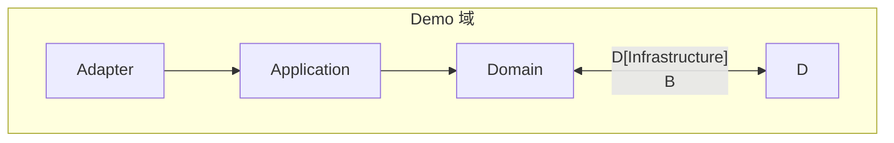

## 分层架构

## 各层组件

### [Adapter 接口层](/domains/demo/adapter/) (1 个组件)

| 类名 | 类型 | 源代码 |
| ------ | ------ | ------ |
| `OldCtrl` | controller | `OldCtrl.java` |
### [Infrastructure 基础设施层](/domains/demo/infrastructure/) (1 个组件)

| 类名 | 类型 | 源代码 |
| ------ | ------ | ------ |
| `DemoDO` | persistentObject | `DemoDO.java` |
